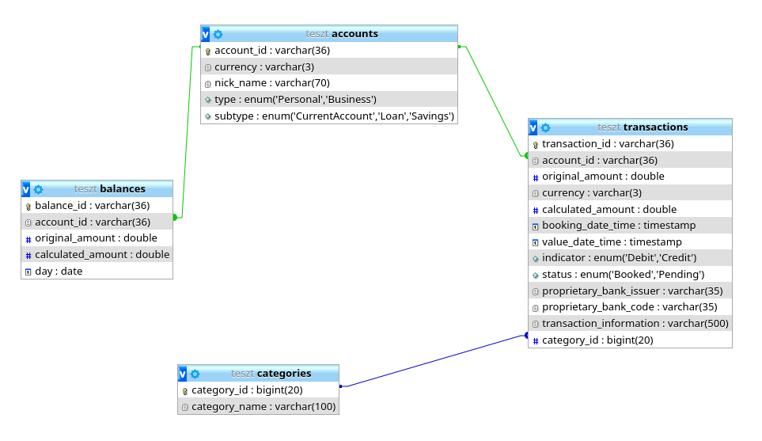
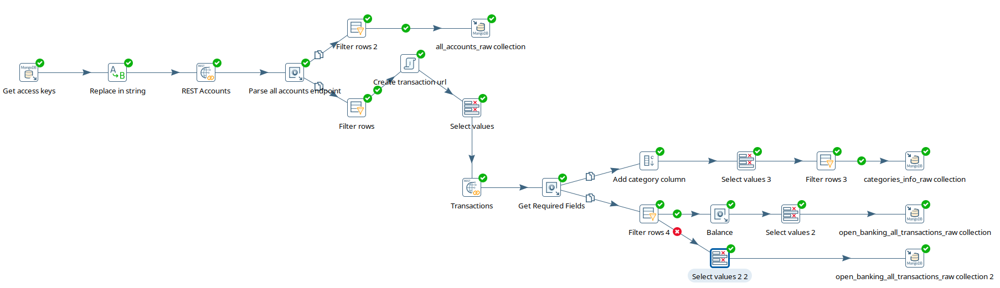
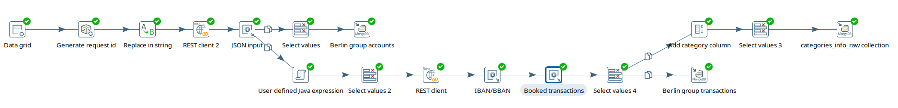
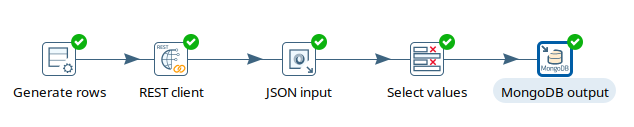
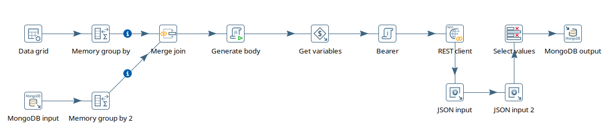
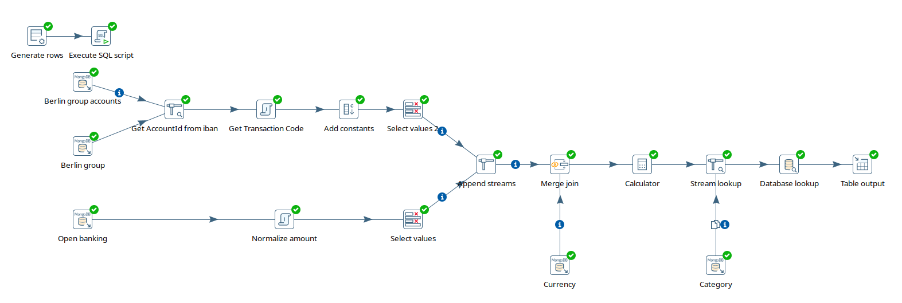
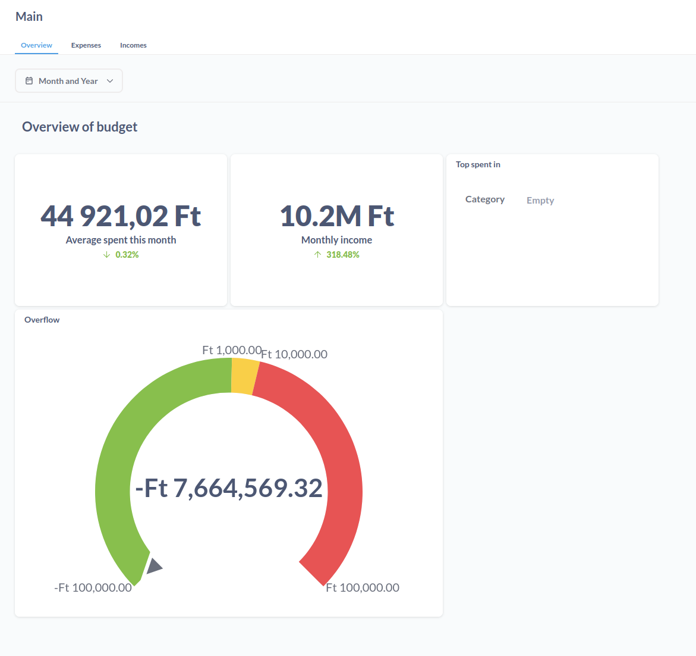

# **BIGFISH**

## [GITHUB_LINK](https://github.com/WitherCOM/bigfish-uzleti-hf)

## **Infrastruktúra**
A Business Intelligence stack megvalósításához docker-t és docker compose-t használtam. A compose-ban 5 darab konténer fut:
- Metabase: A BI rendszer és dashboard megjelenítő oldal
- MongoDB: Ez egy dokumentum alapú adatbázis, melyben a nyers adatokat tárolom, közvetlenül az adatforrásból történő beolvasás után
- Pentaho Data Integration: Az egyik konténer az ETL jobok futásáért felelős, ehhez a Pentaho BI stack data integration részét használom.
- Traefik: A traefik egy reverse proxy (és load balancer), jelen esetben nem annyira szükséges, de amennyiben kiegészülne a stack további weboldalakkal hasznos lehet, illetve segít az automatikus TLS Certificate igénylésben.
### Docker-compose
A rendszert  a `docker compose up` paranccsal tudjuk elindítani. A futó adatbázisok alapvetően csak a többi konténerből elérhetők. Az előző miatt a fejlesztés során (a *Spoon* használatához) érdemes a *127.0.0.1*-re kinyitni a két adatbázis portját a config fájlban (ez a `docker-compose.dev.yml`) fájlban találtható, valamint érdemes lokálisan felvenni a *mongodb*, *mariadb* hoszt neveket a *127.0.0.1*-re.

## Adatforrások
Két alapvető adatforrásom volt, az egyik az Open Banking API, amit számos interneten is elérhető bank implementál. Ennek segítségével számos banki funckiót lehet elérni egy REST api-n keresztül, ezek közül ez a rendszer azt használja, amivel fiók (account) információkat, illetve tranzackió információkat lehet lekérni. A másik PSD2 szabványú Banking API volt.

Használok egy [árfolyam API](https://currencyapi.com/)-t, aminek segítségével az aktuális árfolyamok kérhetőek le. Ennek segítségével konvertálom, ugyanarra a valutára a tranzakciók értékeit, hogy össze lehessen őket vonni.

### Revolut
A revolut egy manapság gyakran használt internetes bank, ami rendelkezik Open Banking API-val. Ahhoz, hogy a revolutos felhasználóktól le tudjuk kérdezni a tranzakciós adatokat szükségünk van egy `access_token`-re, ami az adott felhasználóhoz tarotzik. Ennek megigénylése nem egy egyszerű folyamat viszont tartozik hozzá egy sandbox környezet, amiben tesztelni tudjuk a rendszerünket. A `token` megigénylésének folyamata [ezen](https://developer.revolut.com/docs/guides/build-banking-apps/get-started/register-your-application-in-the-developer-portal) a linken érhető el. Ennek egyszerűsítéséhez, illetve a `token`-ek tárolására létrehoztam egy egyszerű [FastAPI](https://fastapi.tiangolo.com/)-s projektet, ami a `revolut` mappában található (ennek működését nem részletezem). Az elöbbi alkalmazás lényege, hogy engedélyezzük a rendszer számára, hogy hozzáférjen a revolut felhasználónkhoz.
#### REST endpoints
```
GET https://sandbox-oba.revolut.com/accounts
GET https://sandbox-oba.revolut.com/accounts/{AccountId}/transactions
```

### [Mockbank](https://app.mockbank.io)
A banki környezeteknek a sandbox-a nem mindig töktéletes, illetve a legtöbb esetben nem is arra van kialakítva, hogy a teszt tranzakciókkal legyen feltöltve, inkább arra, hogy a belépést tudjad tesztelni. Ebben segít a mockban, ahol tetzsőleges mennyiségű tranzakciót tudsz létrehozni, majd API-val lekérni azokat. [Ebben](https://jrholding.atlassian.net/wiki/spaces/MPD/pages/685637682/Working+with+PSD2+XS2A+API) a dokumentációban van leírva, hogyan lehet használni.

### [OTP](https://portal-sandbox.openbanking.otpbank.hu/#/)
Az OTP hasonló [Banking API](https://portal-sandbox.openbanking.otpbank.hu/#/)-val rendelkezik, ez is egy lehetséges adatforrás.

### [Currency API](https://currencyapi.com/)   
Ez részben ingyenes árfolyam API, aminek segítségével az akutális valuták, egy megadott valutában, értékei kérhetők le. Az ingyenes verzió *rate limit*-elve van, ez azt jelenti, hogy 1 hónap-ban csak 100 ingyenes kérésed lehet. Ebben az esetben figyelni kell, hogy az ETL job ne hívja meg túl sokszor ezt az endpointot.
```
GET https://api.currencyapi.com/v3/latest?apikey=${currency_api_key}&currencies=&base_currency=HUF
```
Ahhoz, hogy használni tudjuk a fenti endpoint-ot szükségünk van egy api kulcsra, amit az oldalra regisztráció után kapunk meg. Ezt a `kettle.properties` fájlba kell beleírni.

### [OpenAI](https://platform.openai.com)
Az OpenAI api segítéségvel kategorizálom be a tranzakciókat az előre megadott kategóriákba.


## Adatbázisok

### MariaDB
Ezt az adatbázis a `scripts/init_mariadb.sql` paranccsal tudjuk inicializálni.
```sh
docker exec -i bigfish-mariadb-1 mariadb -pmariadb1234 < ./scripts/init_mariadb.sql  
```
Ennek segítségével létrehozunk két adatbázist, egyet a [Metabase](https://www.metabase.com/)-nek, egyet pedig *staging* adatoknak.
#### Táblák
Az adatbázis négy táblából ált, ezekbe már a normalizált adatok kerültek az ETL jobokból.


### MongoDB
A MongoDB egy dokumentum alapú adatbázis, amit a nyers adatok tárolására használok. Azért ezt választottam erre a célra, mert flexibilisen tudom tárolni a különböző adatforrásokból származó adatokat, struktúrákat ugyanis ebben az esetben nem kell sémát definiálni.
#### Collections
A különböző célú adatokat különböző kollekciókban helyeztem el, így a következő kolleciók jöttek létre:
- open_banking_all_accounts_raw
- open_banking_all_transactions_raw
- berlin_group_all_accounts_raw
- berlin_group_all_transactions_raw
- all_currencies_raw
- categories_info_raw
- access_tokens

A kollekciókba az adatokat transzformáció nélkül nyersen töltöttem be.

## ETL/ELT jobok

ETL/ELT motornak a [Pentaho](https://www.hitachivantara.com/en-us/products/pentaho-plus-platform/data-integration-analytics.html) Bs in expense
I Stack [data intation](https://help.hitachivantara.com/Documentation/Pentaho/Data_Integration_and_Analytics/9.1/Products/Pentaho_Data_Integration) (régen Kettle) részét használtam. Ehhez tartozott a Pentaho Spoon nevű alkalmazás, aminek segítségével ezek a folyamatok grafikuson szerkeszthetők.

### Job-ok és Transformációk
A data integration-ben két folyamat elemet lehetett definiálni. Az egyik volt a job, amivel ütemezni lehet feladatokat, a másik volt a transformation, amivel az adatokat lehett betölteni, illetve általakítani. A következőkben az általam definiáltakat fogom bemutatni.

#### Open banking API nyers adat betöltése
Ez egy 10 percenként futó job, ami a különböző beregisztrált UK Open Banking API endpointokról tölti be az adatokat. Az én esetben ez csak a revolut sandbox környezetből töltött be adatokat

A folyamat során lekérdeztem a token-eket, majd letároltam azokat. Ezután egy következő lépésben végeztem el a tranzakciók betöltését.

A fenti ábrán látható a betöltési folyamat. Először lekérdezem a token-eket, majd ezek segítségével betöltöm az account-okat egy kollekcióba és létrehozom a tranzakciókat lekérő url-eket. Ezután ennek segítségével lekérem a tranzackiókat, amiket letárolok, illetve a különböző tranzakció információkat belerakom egy másik kollekcióban, amin az openAI-t fogom futtatni.


#### PSD2 nyers adat betöltése
Ez egy 10 percenként futó job, ami a különböző beregisztrált PSD2 API endpointokról tölti be az adatokat. Az én esetben ez csak a mockbank környezetből töltött be adatokat.

A folyamat során az előre beállított token-eket használva, hívom meg a megfelelő endpointokat, amikkel az account,illetve tranzakciós adatokat töltöm be.



#### Árfolyamok lekérdezése
Ez egy egyszerű transzformáció, aminek segítségével az árfolyamokat kérem le, majd tárolom el. Ebben az esetben az ütemezést minden nap reggel 7órára állítottam.


#### Category beosztás
A mentett kategória nyers táblából kiszedetett információkat az OpenAI segítségével számolom ki, ügyelve arra, hogy ne lépjem túl a rate limit-et.


#### Staging táblák feltöltése
Ebben a transzformációban a nyers táblákból lekért adatot a normalizált mariadb táblákba töltöm át a következő transzformáció segítségével


Ebben a transzformációban lekérem a megfelelő tranzakciókat. Ezután illesztem a megfelelő árfolyammal, majd átszámítom az alapárfolyamba (az én esetemben a forintba) és kiírom táblákba. Közben egy lookup table segítségével kategoriát választottam a megfelelő tranzakció információhoz. Illetve beosztom, hogy ami income-nak számít az +, ami kiadásnak annak - előjele legyen. Ez a job 10 percenként fut.


## Metabase
A [Metabase](https://www.metabase.com/) egy self-hostolható business intelligence rendszer, amelyekkel interkaktív dashboardokat, majd belőlük pdf reportokat lehet készíteni.

A Metabase-t úgy állítottam be, hogy a saját MariaDB-ben tárolja az adatait, ezért ehhez kiexportáltam a `scripts` mappába az aktuális állapotát ennek. Amit lefuttatva helyreállítható.
```
docker exec -i bigfish-mariadb-1 mariadb -pmariadb1234 < ./scripts/metabase.sql
```
A belépési adatok az admin felhasználóhoz:
```
email: teszt.elek@example.com
password: admin1234
```
### Felépítés
A Metabase különböző részekből áll. Vannak raw data source-ok, amiket az alapjai a model-eknek. A modellek adat lekérések, amiben fel lehet az oszlopokat meta adatokkal tagelni. Vannak Question-ök, amikkel ezekből a modellekből tudunk kérdezni és vizualizálni az adatot. Ezeket az elemeket tudjuk a Dashboard-ra felrakni.

### Modellek
Három modelt definiáltam, egyet a bevételre, egyed a kiadásokra és egyet ezek összehasonlítására.

### Dashbord

Definiáltam egy dashboard-ot három füllel. Egy átfogó összefoglaltom a statisztikáról. És két darab -külön-külön tabot a bevételek és kiadások összegzésére.


## Mi nem valósult meg?
- Az excelből történő betöltés
- A balances tábla feltöltése
- Csalás felderítés

## További fejlesztési lehetőségek
- Egyéb Open Banking API, illetve PSD2 api-k bekötése (pl.: OTP)

- A Pentaho Data Integration(Kettle) lecserélése [Apache Hop](https://hop.apache.org/)-ra
  - A Kettle-t régen sokan használták, de manapság egyre kevésbé fejlesztik
  - Nagyobb flexibilitással bír, a Kettle egy forkjából alakult ki, aktívan fejlesztik
- Metabase lecserélése Apache Superset-re
  - Kód alapú dashboard fejlesztés (de van vizuális editor is) -> könnyebb a dokumentálása és mentése
  - Több beépített grafikon, illetve lehetőség saját készítésére
  - lightweight
- Csalás detektálás
  - Fizetések elemézése, hogy nincs-e valami gyanús kiadás, vagy ismétődő

